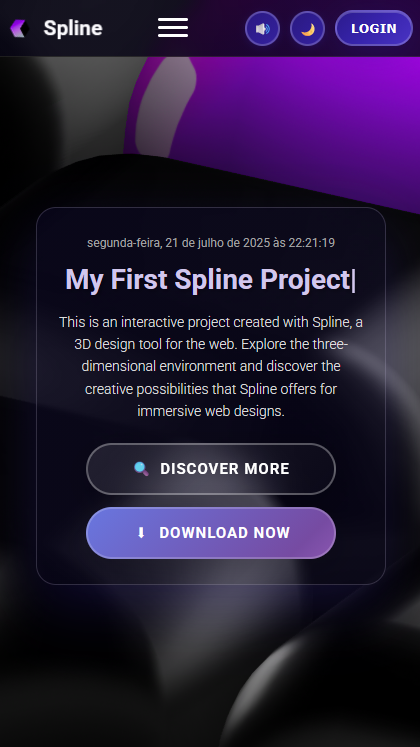
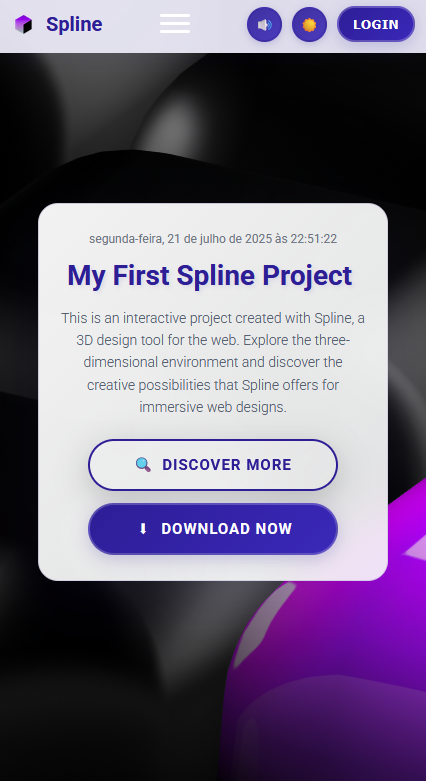

# 🎨 Projeto Spline - Versão com Áudio
<p align="center">
  
  
  
</p>

<p align="center">
  
</p>

## 📋 Sobre o Projeto
O **Projeto Spline Organizado** é uma experiência 3D interativa criada com a ferramenta [Spline](https://spline.design/), voltada para web.
Com **visual imersivo**, **interações refinadas**, **tema claro/escuro** e **sistema de áudio**, é ideal para explorar a integração entre código e design 3D.

## 🌐 Visualize o Projeto
Você pode visualizar o projeto online através deste [link](https://devAndreotti.github.io/my-first-spline-project).

## ⚙️ Funcionalidades Principais
* 🧩 **Experiência 3D com Spline**: Visual imersivo carregado diretamente no navegador.
* 🎨 **Tema Claro/Escuro**: Alternância fluida com armazenamento da preferência.
* 🔊 **Sistema de Áudio Modular**: Sons reativos e configuráveis.
* 📱 **Design Responsivo**: Adaptado para todos os tamanhos de tela.
* 💬 **Modal de Contato Validado**: Máscara de telefone, validação e acessibilidade.
* ⚡ **Performance Otimizada**: Lazy loading, cache e controle de movimento.

<p align="center">
  
  
</p>

## 🛠 Tecnologias Utilizadas
* **[HTML5](https://developer.mozilla.org/pt-BR/docs/Web/HTML)** — Estrutura semântica moderna.
* **[CSS3](https://developer.mozilla.org/pt-BR/docs/Web/CSS)** — Estilização com Flexbox, Grid e animações.
* **[JavaScript ES6+](https://developer.mozilla.org/pt-BR/docs/Web/JavaScript)** — Interatividade e lógica dinâmica.
* **[Spline](https://spline.design/)** — Visualização 3D diretamente na web.
* **[Web Audio API](https://developer.mozilla.org/en-US/docs/Web/API/Web_Audio_API)** — Sistema de áudio controlado via JS.

## 📁 Estrutura do Projeto
```
spline-project-organizado/
├── index.html                # Página principal
├── README.md                 # Documentação
└── src/
    ├── css/
    │   └── style.css         # Estilos organizados e comentados
    ├── js/
    │   ├── audio.js          # Sistema de áudio modular
    │   └── main.js           # Funcionalidades principais
    └── img/
        ├── icon.png          # Ícone do projeto
        └── project/
            ├── desktop-project.png
            └── mobile-project.png
```

## 🔍 Melhorias
### 📦 Organização do Código
* **HTML**: Semântico, comentado, com tags corretas e otimizado para SEO.
* **CSS**: Modularizado em 13 seções, com variáveis, responsividade e `prefers-reduced-motion`.
* **JavaScript**: Arquitetura em módulos, documentação JSDoc, validações e localStorage.

### ♿ Acessibilidade
* Navegação via teclado (`Tab`, `Enter`)
* Leitores de tela suportados
* Cores com contraste adequado
* Suporte a movimento reduzido

### 🚀 Performance
* Lazy loading de recursos
* Efeitos com `transform` e `opacity`
* Otimizações para dispositivos mais lentos

## 📝 Licença
Este projeto está sob a licença MIT.
Consulte o arquivo [LICENSE](https://github.com/devAndreotti/devAndreotti/blob/main/LICENSE) para mais detalhes.

---

<p align="center">
  Desenvolvido com ☕ por <a href="https://github.com/devAndreotti">Ricardo Andreotti Gonçalves</a> 🧑‍💻
</p>
